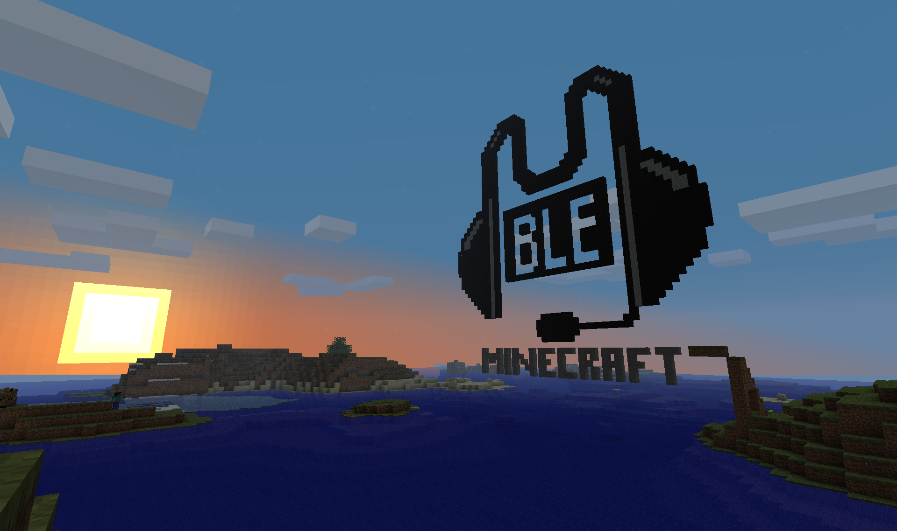
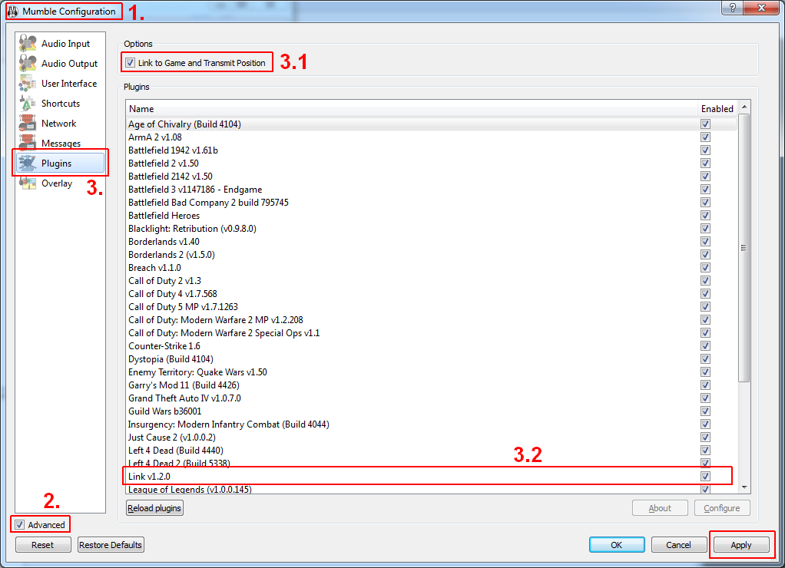
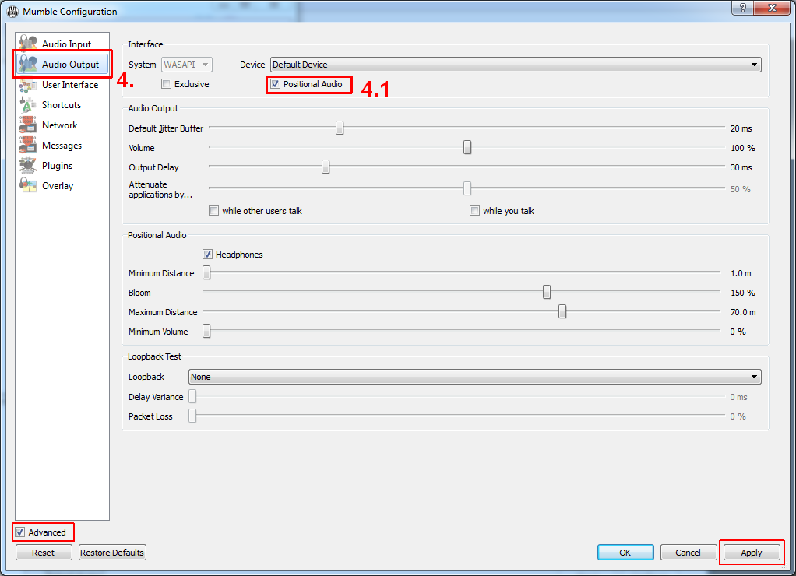
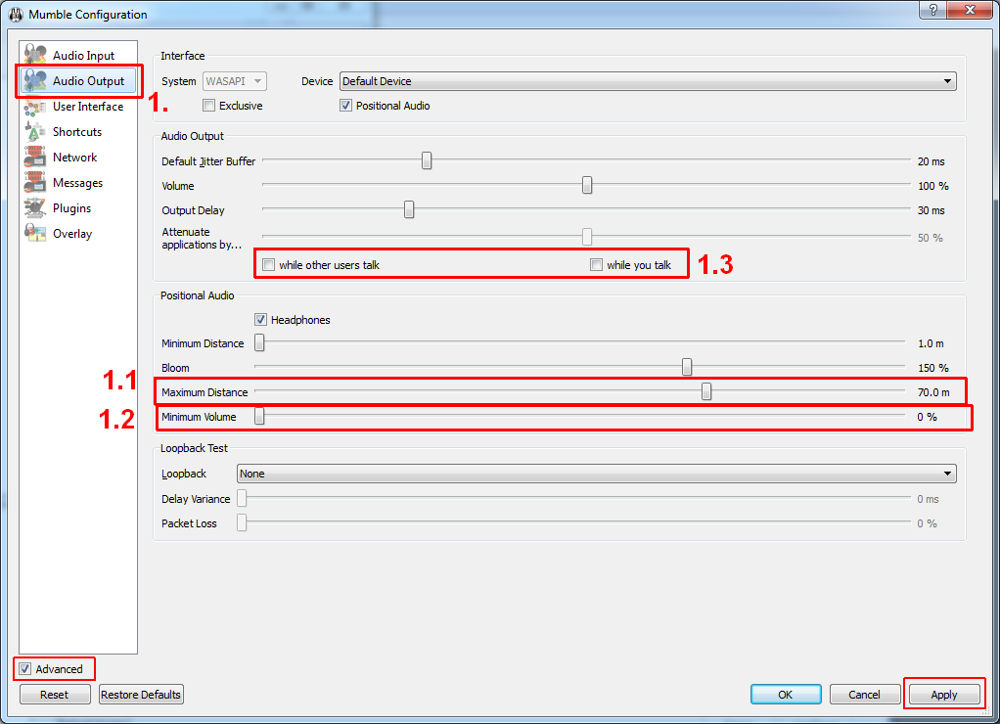
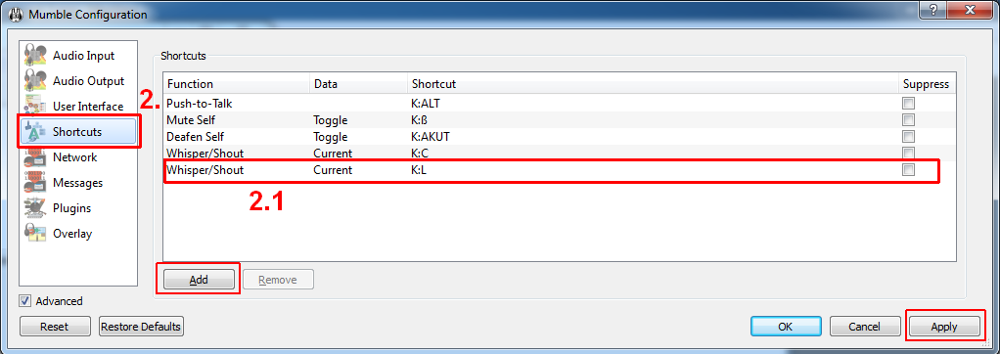

[](https://www.curseforge.com/minecraft/mc-mods/mumblelink/files)
[](https://www.curseforge.com/minecraft/mc-mods/mumblelink/files)
[](https://www.curseforge.com/minecraft/mc-mods/mumblelink/files)

<p align="center">
  
</p>

# About:

***Minecraft + Mumble + MumbleLink = You hear where voices come from and how far away they are!***

This is a **client-side Minecraft mod based on "Minecraft Forge"**. It's purpose is to be able to use Minecraft in conjunction **with [Mumble](https://mumble.info)**'s positional audio feature.

This means: Directional and positionally attenuated VOIP in relation to the game world.

There is also a corresponding [Minecraft Forum thread](http://www.minecraftforum.net/topic/217587-).


# Prerequisites:

* [Minecraft Java Edition](https://www.minecraft.net)
* [Minecraft Forge](https://files.minecraftforge.net/)
* [Mumble](https://mumble.info)
  * advanced option "Link to Game and Transmit Position" activated  
     (Configure -> Settings -> Tick "Advanced" -> "Plugins"
        -> Tick "Link to Game and Transmit Position")


# Installing the Mod:

1. Close both Mumble and Minecraft.
2. install Minecraft Forge
3. Put the MumbleLink-x.y.jar into your mods folder (DO NOT EXTRACT THE JAR!)  
    examples:  
    * Windows: %Appdata%\.minecraft\mods\MumbleLink-x.y.jar  
    * Linux: ~/.minecraft/mods/MumbleLink-x.y.jar  
4. setup Mumble:  
      
    1. On Mumble's main screen select Configure -> Settings
    2. In Mumble Configuration dialog enable "Advanced" (bottom left)
    3. In Plugins: 
        1. Options section: enable "Link to Game and Transmit Position",
                            if this was disabled, restart after setting this option
        2. in Plugins section: find and enable "Link v1.2.0"
    4. In Audio Output:  
	      
        1. in Positional Audio section: enable Positional Audio´
    5. optional advanced Mumble settings can be found further [below](#advanced-mumble-configuration)


# Upgrading from earlier Versions:

1. Close both Mumble and Minecraft.
2. install latest Minecraft Forge
3. replace the old MumbleLink-jar with the new one!


# Advanced Mumble Configuration

Instead of hearing people from indefinitely far away you can set up mumble to
only hear them when they are close. In return you (and they!) will need to bind
an extra key to communicate with those far away (imagine it being a
"walkie-talkie" button).  
To set this up you will need to do some special settings which differ from the
defaults, in return it might enhance your audio experience.  

1. In Audio Output:  
	    
	1. Positional Audio section: Maximum Distance: 70m   
		(this value will determine when others are too far away to be heard)  
	2. Positional Audio section: Minimum Volume: 0%  
		(this value makes you not hear people beyond Maximum Distance)  
	3. Audio Output section: disable "Attenuate applications by... " "while other users talk" and "while you talk"   
		(mumble would dampen ArmA's audio if enabled)
2. In Shortcuts   
	  
	1. bind a key ("Shortcut") to "Shout/Wisper" "Shout to Channel" select "Current" Channel and make sure to check "Ignore positional audio"   
		(this will enable you to speak to everyone no matter how far away they are or what their settings are)  


# Notes:

* suggested Mumble settings (differing from defaults):  
  * advanced option "Link to Game and Transmit Position" activated
    (restart after setting this option)
  * Maximum Distance: 70m
  * Minimum Volume: 0%
  * untick "Attenuate applications by..." "while other users talk" and "while you talk"
* link delay: 10 seconds - normal link delay appears to be about 10 seconds after
    joining a minecraft server. This may vary depending on the PC. The confirmation
    that the plugin linked can however show before the effect kicks in.
* starting order: does not matter  
    Minecraft or Mumble - either can be started first


# Mod-Packs:

Generally you are free to distribute it with your private (or public, or commercial) mod-packs as specified by LGPLv3.  
That being said, it virtually means no restrictions apply except that you should inform users that your mod-pack contains this mod and that it is licensed under LGPLv3.

Feel free to drop a note [on the forum](http://www.minecraftforum.net/topic/217587-) that your pack contains this mod. It might give you some more users and I simply am curious to see where it is used (totally optional!).


# Developing Addons for this Mod:

* Please also refer to changelog of v4.0.2 and the source code comments.
* The interface [`MumbleLinkAPI`](https://github.com/zsawyer/MumbleLink/blob/QnD-MC_JNA/mod/src/main/java/zsawyer/mods/mumblelink/api/MumbleLinkAPI.java) allows your addon to inject their custom Mumble
    context and/or identity. Use this interface to register your callback
    function handlers. You will have to implement the callback interfaces. It is
    suggested that your addon implements the "Activatable" interface to allow
    other (child) addons to disable your handlers and thus overriding/replacing
    them. This is neccessary since the context and identity fields have a very
    limited length.  
* The [`ExtendedPASupport`](https://github.com/zsawyer/MumbleLink/blob/QnD-MC_JNA/mod/src/main/java/zsawyer/mods/mumblelink/addons/pa/es/ExtendedPASupport.java) mod should serve as a sample implementation.  
* Please note the javadoc of these files.  
* For more information about context and identity consult [mumble's doc](https://wiki.mumble.info/wiki/Link#Context). 
        


# Troubleshooting:

* Please check the logs in your .minecraft-folder for an error message.  
      for Forge: fml-client-latest.log  
  * messages from this mod will be indicated by "[MumbleLink]" infront of the message  
* Errors will occur as "Minecraft has crashed!"  or a black window
  * This either indicates incompatibility to your operating system
  * or you are using an outdated version of the mod
  * check the error report or log files (s.a.) for details


# FAQ:

#### How do I know that I am linked/the mod works?
 After connecting to a Minecraft-Server (joining a game) Mumble's log will
    show a message "Minecraft linked." after a few seconds. Additionally
    within Minecraft you will see a chat message "Mumble linked." after you have
    joined any world.
	
#### Mumble does not Link:
check the logs and check for MumbleLink (Forge)  
  * you might not have Forge installed
  * note that Risugami's ModLoader is not supported anymore
		
#### Minecraft crashes:
```log
    "Minecraft has crashed!
    ...
    java.lang.NoSuchFieldError: g
        at UpdateData.set(UpdateData.java:XXX)
    ..."
```
OR
```log
    "Minecraft has crashed!
    ...
    -- Head --
    Stacktrace:
        at UpdateData.set(UpdateData.java:XXX)
    ..."
        - You are using an incompatible mod version.
        - Get the appropriated one from https://sourceforge.net/projects/modmumblelink/files/
        - there might not be one yet if you just updated Minecraft


    "Minecraft has crashed!
    ...
    Minecraft has stopped running because it encountered a problem; Error in mod
    MumbleLink: Couldn't load library.
    ...
    java.lang.UnsatisfiedLinkError: ..."
```
None of the found libraries can be loaded on your system. Your operating
            system is not supported by this mod. Sorry!  
            Please try to compile the required libraries ([mumble-LinkAPI](https://github.com/zsawyer/mumble-LinkAPI)) yourself or submit a
            request. (If you successfully compiled them yourself please share :D)


#### the log sais:
```log
    "SEVERE: [MumbleLink][SEVERE] Required library could not be loaded,
            available libraries are incompatible!"
```
None of the found libraries can be loaded on your system. Your operating
            system is not supported by this mod. Sorry!  
            Please try to compile the required libraries ([mumble-LinkAPI](https://github.com/zsawyer/mumble-LinkAPI)) yourself or submit a
            request. (If you successfully compiled them yourself please share :D)


#### Mumble sais "Minecraft linked." but I still don't hear people positionally.
Multiple possibilities:  
1. Mumble is not setup correctly:  
	Make sure "Link to Game and Transmit Position" is checked  
		(Configure -> Settings -> Tick "Advanced" -> "Plugins"
			-> Tick "Link to Game and Transmit Position")
2. The others are not using this mod. Get them to install it! ;)


#### Minecraft has no sound/it is really low now
This is probably due to Mumble itself, it will lower other applications'
volumes by default.  
In Mumble advanced settings, within "Audio Output" untick both:  
	"Attenuate applications by..." "while other users talk"
	and "while you talk"


#### No Linking when using Flatpack on Unix
Minecraft Flatpack needs additional permissions: 
1. on the command prompt run `flatpak override --user --device=shm com.mojang.Minecraft` 
2. restart the Minecraft Flatpak if it was already running 

Reason: The Mumble Link works via SHM and `/dev/shm` is by default sandboxed by Flatpak.


# Known Issues:

- Does not work with MicDoodleCore. Libraries will not be loading properly.  
  - A workaround is described in the forum thread. 
  

# For Techies:

It uses the **Mumble Link Plugin v1.2.0** and adds native mumble support.  
Tested with Mumble 1.2.2 - 1.2.4 and PR_Mumble1.0.

It also uses [**JNA**](https://github.com/twall/jna).
There is an interface that other mods can use to inject their custom Mumble
context and/or identity.

The native libraries were originally build at [mumble-LinkAPI](https://github.com/zsawyer/mumble-LinkAPI)


# Additional:

This project is present at both SourceForge and GitHub. The main development will be done using GitHub but the distribution is done through SourceForge.  

There are multiple Forks. 

Also similar projects which deserve an honorable mention: 
- https://github.com/magneticflux-/fabric-mumblelink-mod does the same as this project but has a different implementation


# Acknowledgements:

Thanks for the community keeping this project alive and providing support and updates!

Contributor     | Acknowledgement
----------------|----------------
Mumble Team     | Thanks for Mumble!  
Mojang          | Thanks for Minecraft!  
The MCP Team    | Thanks for Minecraft Coder Pack!  
Forge Team      | Thanks for Forge!  
AbrarSyed       | Thanks for ForgeGradle!  
SilentWalker    | Thanks for testing on XP64, Ubuntu32 and other invaluable support.  
talkingBEERmug  | Thanks for testing and decompiling the 128-bit encryption  
Steeve          | Thanks for providing the Mumble-Server we tested on  
xDownSetx, Zebra| Thanks for helping with testing  
dalawrence      | Thanks for providing the source code of a [similar project](http://www.minecraftforum.net/viewtopic.php?f=1&t=41506) which helped in optimizing the DLLs and compiling for multiple platforms  
theskorm        | Thanks for helping with compiling libraries for linux 64 bit and providing libs for MACOSX (and testing) and helping with recompiling/reobfuscating  
davr            | Thanks for jumping in and helping with recompiling/reobfuscating  
twall           | Thanks for JNA!  
iSuchtel        | Thanks for helping with compiling the universal dylib for OSX  
Robijnvogel     | Thanks for keeping this mod alive while I was away.
magneticflux-   | Thanks for keeping this mod alive while I was away.
